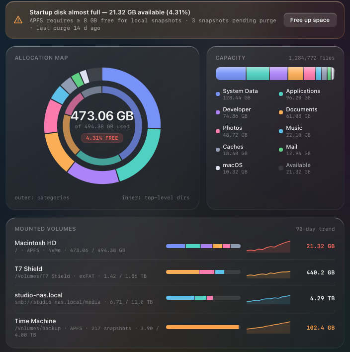
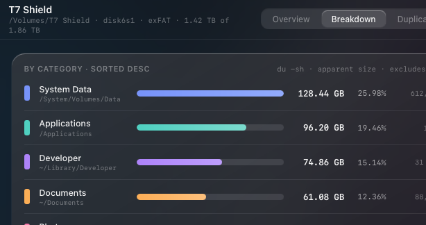
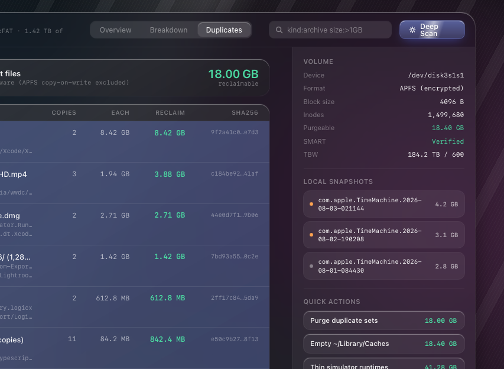
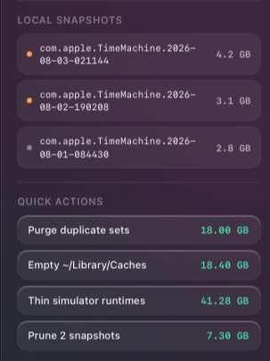
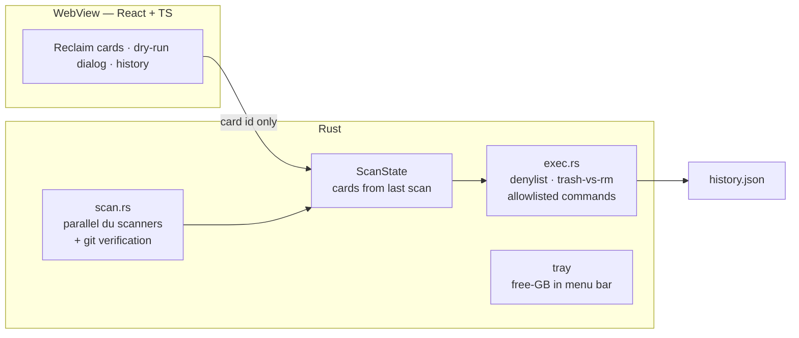

<p align="center">
  
</p>

<h1 align="center">Alpheus</h1>

<p align="center">
  The macOS storage pane — but honest, drillable, and able to actually fix things.
  <br />
  <a href="#why">Why</a> ·
  <a href="#what-it-does">What it does</a> ·
  <a href="#safety-model">Safety model</a> ·
  <a href="#architecture">Architecture</a> ·
  <a href="#getting-started">Getting started</a>
</p>

<p align="center">
  
  
  
</p>

<p align="center">
  <a href="https://github.com/onembyte/alpheus/releases/latest/download/Alpheus-macOS.dmg">
    
  </a>
  <br />
  <sub>Unsigned build — right-click → Open on first launch.</sub>
</p>

<p align="center">
  
</p>
<p align="center">
  
  
  
</p>
<p align="center"><sub>The Alpheus design system — liquid glass, designed in Claude Design.</sub></p>

## Why

Every developer Mac slowly fills up, and when it does, macOS Settings shows a
giant, unexplained **"System Data"** blob and offers no way to act on it. The
real story is always the same cast of characters — a forgotten Docker VM disk,
a dozen `node_modules`, Xcode's DerivedData and device symbols, app caches,
staged OS updates — and finding them means terminal archaeology with `du`
every single time.

This app was born from one such archaeology session on a chronically full
245 GB MacBook (~90 GB of "System Data" decoded by hand). It turns that
one-off audit into a permanent, one-glance, one-click desktop tool.

## Design

The UI is a liquid-glass design system (designed in Claude Design): a
token-driven set of glass surfaces over an animated wallpaper, with full
dark **and** light appearances (System/Light/Dark in Settings), an allocation ring
and glossy capacity bar fed by real scan data, breakdown-style rows with
proportional bars, a top-drop confirmation sheet, and SF-mono typography
for every number and path. Decorative motion respects
`prefers-reduced-motion`.

## What it does

- **Scans the real space hogs** in parallel (`du -sk` actuals, not estimates):
  Docker/colima VM disks, per-project `node_modules` and `.next`, Xcode
  DerivedData / device symbols / simulators, `~/Library/Caches`, Spotify,
  package-manager caches (npm, pnpm, NuGet, CocoaPods, Go, Playwright),
  iPhone backups, Time Machine local snapshots, the Finder Trash, and staged
  macOS updates.
- **Explains every finding in human terms** on a reclaim card: what it is, how
  big it is, what happens if you remove it, and exactly which paths die.
- **Proves it's safe before offering one click.** `node_modules` folders are
  only marked safe when the owning repo is *clean, has a remote, and has zero
  unpushed commits* — the card shows the `git status` evidence. Everything
  else lands in a "needs a decision" tier with a mandatory review dialog.
- **Lives in the menu bar**: the free-space number is always visible, turns
  into a ⚠️ warning below a configurable threshold, and clicking it opens the
  main window.
- **Scans and cleans on a schedule**: optional background scans (hourly to
  daily) with low-space notifications, plus opt-in automatic cleanup of
  safe-tier categories you mark — enforced in Rust to the safe tier only.
- **Logs every action** to a history view — "freed 23.4 GB on Aug 3", with
  automatic runs tagged `auto`.

## Safety model

The interesting part of a disk cleaner is not deleting files — it's making it
structurally hard to delete the wrong ones. All rules live in the Rust
backend and hold no matter what the UI requests:

| Rule | Enforcement |
|---|---|
| Three tiers | `safe` (green, regenerable, one click) · `with-care` (yellow, confirm dialog + checkbox) · `manual` (grey, explain-only, no action wired) |
| Dry run before any delete | The confirm dialog lists the exact paths with per-path sizes, freshly re-measured |
| Denylist | Nothing outside `$HOME`; never `~/Documents/prod`, `~/.ssh`, `~/.claude`, `~/Library/Keychains` — checked at scan **and** execute time |
| Trash first | Totals under 5 GB go to the Finder Trash (reversible); direct `rm` is reserved for an allowlist of known-regenerable card ids; iPhone backups go to the Trash at any size |
| No path injection | The frontend can only send a card *id* over IPC — paths, sizes and methods come from the backend's own last scan |
| No shell injection | Command cards (`brew cleanup`, `xcrun simctl`, `tmutil`) run a fixed argv keyed by card id; no frontend string reaches a shell |
| No root | Everything is user-space; system-level items (staged OS updates) are explain-only cards |

## Architecture

Tauri 2 · Rust backend · React + TypeScript + Tailwind 4 frontend.



- **`scan.rs`** — category scanners run in scoped threads; sizes come from
  batched `du -sk` calls; per-project git checks produce the "proof" shown on
  cards. Produces data only, never deletes.
- **`exec.rs`** — the single module allowed to remove anything. Re-verifies
  the denylist per path, chooses Trash vs `rm` by size and allowlist,
  and maps command cards to fixed argv.
- **`lib.rs`** — IPC commands, tray icon with a live free-space title
  (refreshed every 60 s), close-to-tray window behavior.
- **Frontend** — tier-grouped cards, a usage meter (in use / safe to reclaim /
  needs a decision / free), dry-run confirm modal, history log. No state of
  its own beyond the last scan response.

## Getting started

Requires macOS, [rustup](https://rustup.rs), Node 22+, and pnpm.

```bash
pnpm install
pnpm tauri dev     # run in development
pnpm tauri build   # produce the .app bundle
```

First run: macOS will ask for access to folders like Documents — that's the
scanner measuring your projects. The first scan takes up to a minute; rescans
are seconds.

```bash
pnpm icons         # regenerate all icons (zero-dependency PNG writer)
```

## Project layout

```
src/                    React frontend (cards, dialog, meter, history)
src-tauri/src/scan.rs   category scanners + git verification
src-tauri/src/exec.rs   safety rules + executor
src-tauri/src/lib.rs    IPC, tray, window lifecycle
src-tauri/src/disk.rs   df-based disk usage
src-tauri/src/history.rs  action log
scripts/make-icons.mjs  procedural app/tray icons (no image deps)
```

## Roadmap

- **Offload to NAS**: pick a cold folder → upload via WebDAV or rsync →
  checksum-verify the remote copy → only then reclaim locally, leaving a
  `.offloaded` breadcrumb.
- Incremental scan cache (SQLite) so rescans only re-measure changed roots.
- Signed + notarized builds.

## License

[MIT](LICENSE)
